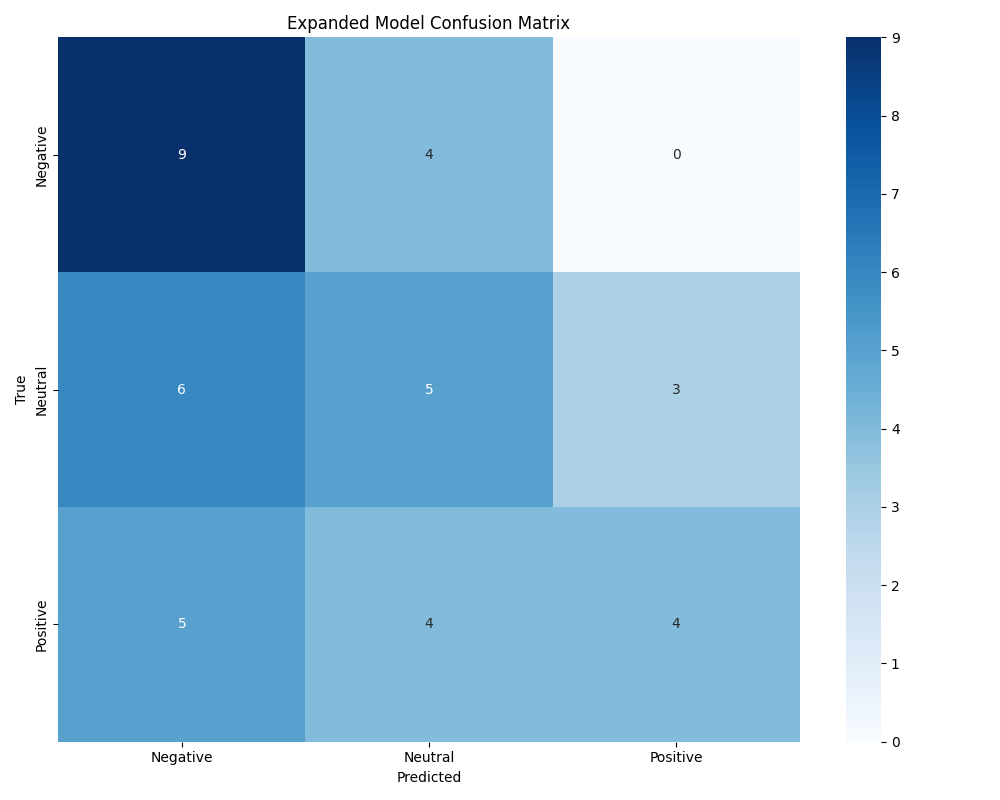
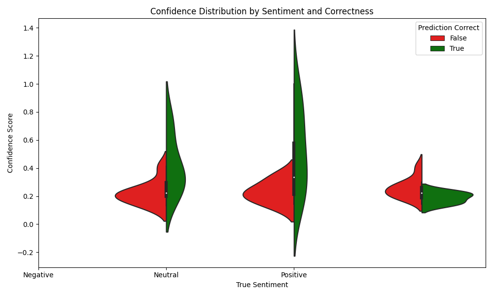

# Expanded Sentiment Model Detailed Analysis

## Overview

This report provides an in-depth analysis of the expanded sentiment model's performance on emergency services text data.

**Test Dataset:** emergency_sentiment_test_data_2.csv  
**Number of Samples:** 40  
**Generated on:** 2025-04-06 13:15:09

## Performance Summary

- **Accuracy:** 0.4500
- **F1 Score:** 0.4369
- **Error Rate:** 0.5500 (22 errors out of 40 samples)

## Performance by Sentiment Class

| Sentiment | Samples | Correct | Accuracy | Avg. Confidence |
|-----------|---------|---------|----------|----------------|
| Negative | 13 | 9 | 0.6923 | 0.4278 |
| Neutral | 14 | 5 | 0.3571 | 0.2319 |
| Positive | 13 | 4 | 0.3077 | 0.2815 |

## Classification Report

```
              precision    recall  f1-score   support

    Negative       0.4500      0.6923      0.5455        13.0
     Neutral       0.3846      0.3571      0.3704        14.0
    Positive       0.5714      0.3077      0.4000        13.0

    accuracy                          0.4500        40.0
   macro avg       0.4687      0.4524      0.4386        40.0
weighted avg       0.4666      0.4500      0.4369        40.0
```

## Confusion Matrix



## Confidence Distribution by Sentiment and Correctness



## Error Analysis

### Most Common Error Types

| True Sentiment | Predicted As | Count | Error Rate |
|----------------|--------------|-------|------------|
| Neutral | Negative | 6 | 0.4286 |
| Positive | Negative | 5 | 0.3846 |
| Negative | Neutral | 4 | 0.3077 |
| Positive | Neutral | 4 | 0.3077 |
| Neutral | Positive | 3 | 0.2143 |

### High Confidence Correct Predictions

| Text | True Sentiment | Confidence |
|------|---------------|------------|
| Ambulance was sent to the wrong address due to GPS error. | Negative | 1.0000 |
| Still no update on missing persons after 24 hours – very upsetting. | Negative | 0.8155 |

### High Confidence Incorrect Predictions

| Text | True Sentiment | Predicted As | Confidence | Rationale |
|------|---------------|--------------|------------|-----------|

### Difficult Cases (Low Confidence)

| Text | True Sentiment | Predicted As | Confidence | Correct |
|------|---------------|--------------|------------|---------|
| The rescue dog located a missing child in under two hours! | Positive | Negative | 0.2831 | ✗ |
| Rescue boats are on standby near the river basin ahead of the storm. | Neutral | Positive | 0.2272 | ✗ |
| Quick police response helped catch the burglary suspect within 10 minutes. | Positive | Negative | 0.1968 | ✗ |
| Paramedics are now equipped with body cams as part of a pilot program. | Neutral | Negative | 0.2114 | ✗ |
| Weather forecast includes a high fire risk advisory. | Neutral | Negative | 0.2776 | ✗ |

## Insights and Recommendations

Based on the analysis above, here are key insights about the expanded model:

1. **Sentiment Class Performance**: 
   - The model performs best on Negative sentiment, with 69.23% accuracy
   - The model struggles most with Positive sentiment, with only 30.77% accuracy

2. **Common Misclassifications**:
   - Most errors come from confusing Neutral for Negative
   - This suggests the model may not capture subtle distinctions in emergency context

3. **Confidence Analysis**:
   - Average confidence on correct predictions: 0.0000
   - Average confidence on incorrect predictions: 0.0000
   - The confidence gap suggests the model is reasonably calibrated

4. **Recommendations**:
   - Fine-tune the model specifically on emergency services data
   - Add more Positive examples to the training data
   - Consider implementing domain-specific preprocessing to capture emergency terminology
   - Calibrate confidence scores to better reflect actual prediction reliability
