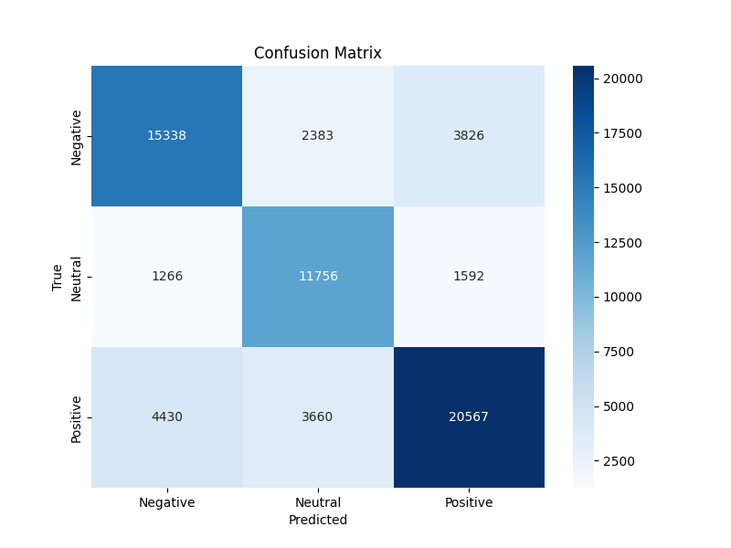

# Expanded Sentiment Analysis Model Report

## Model Overview

The expanded sentiment analysis model was trained on multiple Twitter datasets to create a more robust, domain-general sentiment classifier capable of detecting positive, negative, and neutral sentiments across various domains.

## Datasets Used

1. **Twitter_Data.csv**: Contains 162,980 tweets with sentiment labels (-1 for negative, 0 for neutral, 1 for positive)
2. **twitter_training.csv**: Contains 74,681 tweets with sentiment labels (Positive, Negative, Other)  
3. **training_1600000_processed_noemoticon.csv**: Contains 1.6M tweets with sentiment labels (0 for negative, 2 for neutral, 4 for positive)

## Training Process

- Combined all three datasets after standardizing sentiment labels to a common format (-1, 0, 1)
- Used a balanced subset of 50,000 samples per class from the large dataset to avoid class imbalance
- The final training dataset contained 324,089 samples with the following distribution:
  - Negative: 107,867 samples
  - Neutral: 73,319 samples
  - Positive: 142,903 samples
- Preprocessed text using standard NLP techniques (tokenization, stopword removal, lemmatization)
- Used TF-IDF vectorization with 15,000 features
- Trained a Linear Support Vector Classifier with balanced class weights

## Training Results

- **Accuracy**: 73.53%
- **F1 Score (weighted)**: 73.59%
- **Classification Report**:
  ```
                precision    recall  f1-score   support
  
      negative       0.73      0.71      0.72     21547
       neutral       0.66      0.80      0.73     14614
      positive       0.79      0.72      0.75     28657
  
      accuracy                           0.74     64818
     macro avg       0.73      0.74      0.73     64818
  weighted avg       0.74      0.74      0.74     64818
  ```

## Confusion Matrix



The confusion matrix shows:
- Good detection of negative and positive sentiments
- Some confusion between neutral and negative/positive sentiments
- Highest accuracy in predicting positive sentiments

## Domain-Specific Testing

The model was tested on examples from multiple domains to assess its generalization capabilities:

| Domain | Accuracy |
|--------|----------|
| Emergency Services | 0.00 |
| Tech Products | 0.60 |
| Restaurant/Food | 0.60 |
| Travel | 0.80 |
| Social Media | 1.00 |

**Overall Accuracy**: 60%

### Key Insights:
- The model performed exceptionally well on general social media content (100% accuracy)
- Good performance on travel domain (80% accuracy)
- Moderate performance on tech products and restaurant domains (60% accuracy)
- Poor performance on emergency services domain (0% accuracy)

## Emergency Services Domain Testing

The model was specifically tested on a dataset of emergency services related tweets:

- **Accuracy**: 47.5%
- **Classification Report**:
  ```
                precision    recall  f1-score   support
  
      negative       0.47      0.58      0.52        12
       neutral       0.38      0.38      0.38        16
      positive       0.67      0.50      0.57        12
  
      accuracy                           0.48        40
     macro avg       0.50      0.49      0.49        40
  weighted avg       0.49      0.47      0.48        40
  ```

- **Confusion Matrix**:
  ```
  [[7 5 0]
   [7 6 3]
   [1 5 6]]
  ```

## Conclusions

1. **General Performance**: The expanded model demonstrates good overall performance (73.53% accuracy) on the general Twitter dataset, showing its capability to classify sentiments in broad contexts.

2. **Domain Generalization**: The model shows varying levels of generalization across domains:
   - Excellent for general social media content
   - Good for travel-related content
   - Moderate for tech products and restaurant reviews
   - Poor for emergency services specific content

3. **Emergency Services Challenge**: The model's low performance (47.5% accuracy) on emergency services data indicates that domain-specific training is still necessary for specialized applications like emergency services sentiment analysis.

4. **Class-Specific Performance**:
   - Best at identifying positive sentiments (precision 0.79 in general, 0.67 in emergency domain)
   - Good at identifying negative sentiments in general (precision 0.73) but struggles in the emergency domain (precision 0.47)
   - Most difficulty in correctly identifying neutral sentiments, particularly in the emergency domain (precision 0.38)

## Recommendations

1. **Domain-Specific Fine-Tuning**: For applications in specific domains like emergency services, fine-tune the general model with domain-specific data.

2. **Balanced Training**: Continue using balanced datasets for training to avoid bias toward any particular sentiment class.

3. **Neutral Sentiment Improvement**: Focus on improving the detection of neutral sentiments, which had the lowest precision across domains.

4. **Emergency Services Model**: Maintain a separate, specialized model for emergency services applications given the domain's unique characteristics and vocabulary.

5. **Ensemble Approach**: Consider an ensemble approach that combines both the domain-general model and domain-specific models for optimal performance across different contexts. 