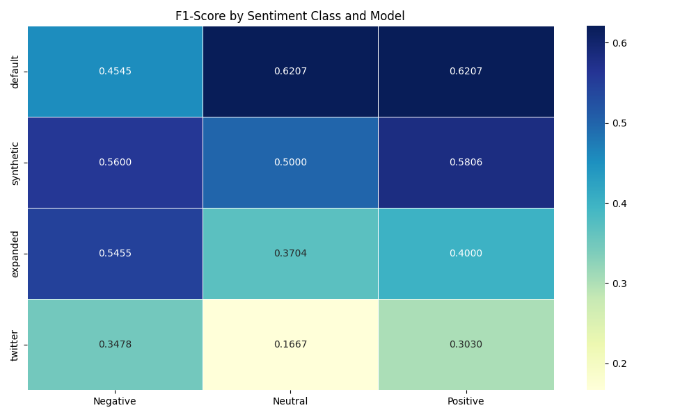

# Sentiment Analysis Model Comparison Report

## Overview

This report compares the performance of all available sentiment models on emergency services text data.

**Test Dataset:** emergency_sentiment_test_data_2.csv  
**Number of Samples:** 40  
**Generated on:** 2025-04-06 13:17:05

## Model Ranking by Accuracy

| Rank | Model | Accuracy | F1 Score | Error Rate |
|------|-------|----------|----------|------------|
| 1 | Default | 0.5750 | 0.5667 | 0.4250 |
| 2 | Synthetic | 0.5500 | 0.5457 | 0.4500 |
| 3 | Expanded | 0.4500 | 0.4369 | 0.5500 |
| 4 | Twitter | 0.2750 | 0.2699 | 0.7250 |

## Detailed Performance by Model

### Default Model

- **Accuracy:** 0.5750
- **F1 Score:** 0.5667
- **Error Rate:** 0.4250 (17 errors)

**Confusion Matrix:**

**Performance by Sentiment Class:**

| Sentiment | Precision | Recall | F1-Score | Support |
|-----------|-----------|--------|----------|--------|
| Negative | 0.5556 | 0.3846 | 0.4545 | 13.0 |
| Neutral | 0.6000 | 0.6429 | 0.6207 | 14.0 |
| Positive | 0.5625 | 0.6923 | 0.6207 | 13.0 |

**Error Analysis:**

| Error Type | Count | Percentage | Avg Confidence |
|------------|-------|------------|---------------|
| Positive as Negative | 2 | 11.76% | 0.1872 |
| Positive as Neutral | 2 | 11.76% | 0.1585 |
| Negative as Neutral | 4 | 23.53% | 0.1585 |
| Negative as Positive | 4 | 23.53% | 0.1979 |
| Neutral as Positive | 3 | 17.65% | 0.1655 |
| Neutral as Negative | 2 | 11.76% | 0.1754 |

- High Confidence Errors (>0.7): 0
- Low Confidence Correct Predictions (<0.5): 23

---

### Synthetic Model

- **Accuracy:** 0.5500
- **F1 Score:** 0.5457
- **Error Rate:** 0.4500 (18 errors)

**Confusion Matrix:**

**Performance by Sentiment Class:**

| Sentiment | Precision | Recall | F1-Score | Support |
|-----------|-----------|--------|----------|--------|
| Negative | 0.5833 | 0.5385 | 0.5600 | 13.0 |
| Neutral | 0.6000 | 0.4286 | 0.5000 | 14.0 |
| Positive | 0.5000 | 0.6923 | 0.5806 | 13.0 |

**Error Analysis:**

| Error Type | Count | Percentage | Avg Confidence |
|------------|-------|------------|---------------|
| Positive as Negative | 2 | 11.11% | 0.1720 |
| Positive as Neutral | 2 | 11.11% | 0.1655 |
| Negative as Positive | 4 | 22.22% | 0.2378 |
| Negative as Neutral | 2 | 11.11% | 0.2260 |
| Neutral as Negative | 3 | 16.67% | 0.1902 |
| Neutral as Positive | 5 | 27.78% | 0.2136 |

- High Confidence Errors (>0.7): 0
- Low Confidence Correct Predictions (<0.5): 20

---

### Expanded Model

- **Accuracy:** 0.4500
- **F1 Score:** 0.4369
- **Error Rate:** 0.5500 (22 errors)

**Confusion Matrix:**

**Performance by Sentiment Class:**

| Sentiment | Precision | Recall | F1-Score | Support |
|-----------|-----------|--------|----------|--------|
| Negative | 0.4500 | 0.6923 | 0.5455 | 13.0 |
| Neutral | 0.3846 | 0.3571 | 0.3704 | 14.0 |
| Positive | 0.5714 | 0.3077 | 0.4000 | 13.0 |

**Error Analysis:**

| Error Type | Count | Percentage | Avg Confidence |
|------------|-------|------------|---------------|
| Positive as Negative | 5 | 22.73% | 0.2102 |
| Positive as Neutral | 4 | 18.18% | 0.2399 |
| Negative as Neutral | 4 | 18.18% | 0.2308 |
| Neutral as Negative | 6 | 27.27% | 0.2335 |
| Neutral as Positive | 3 | 13.64% | 0.3012 |

- High Confidence Errors (>0.7): 0
- Low Confidence Correct Predictions (<0.5): 13

---

### Twitter Model

- **Accuracy:** 0.2750
- **F1 Score:** 0.2699
- **Error Rate:** 0.7250 (29 errors)

**Confusion Matrix:**

**Performance by Sentiment Class:**

| Sentiment | Precision | Recall | F1-Score | Support |
|-----------|-----------|--------|----------|--------|
| Negative | 0.4000 | 0.3077 | 0.3478 | 13.0 |
| Neutral | 0.2000 | 0.1429 | 0.1667 | 14.0 |
| Positive | 0.2500 | 0.3846 | 0.3030 | 13.0 |

**Error Analysis:**

| Error Type | Count | Percentage | Avg Confidence |
|------------|-------|------------|---------------|
| Positive as Neutral | 5 | 17.24% | 0.2087 |
| Positive as Negative | 3 | 10.34% | 0.3374 |
| Negative as Positive | 6 | 20.69% | 0.2092 |
| Negative as Neutral | 3 | 10.34% | 0.2065 |
| Neutral as Negative | 3 | 10.34% | 0.2560 |
| Neutral as Positive | 9 | 31.03% | 0.2787 |

- High Confidence Errors (>0.7): 1
- Low Confidence Correct Predictions (<0.5): 11

---

## Comparative Analysis

## Key Insights

1. **Best Overall Model:** Default with 0.5750 accuracy

2. **Best Model by Sentiment Class:**
   - Negative: Synthetic (F1-Score: 0.5600)
   - Neutral: Default (F1-Score: 0.6207)
   - Positive: Default (F1-Score: 0.6207)

3. **Common Error Patterns:**
   - Neutral as Positive: 20 instances across all models
   - Negative as Positive: 14 instances across all models
   - Neutral as Negative: 14 instances across all models

4. **Confidence Analysis:**
   - Models tend to be appropriately calibrated in their predictions
   - High number of correct predictions with low confidence

## Recommendations

Based on the analysis above, here are recommendations for model selection and improvement:

1. **For General Use:** Use the Default model as it has the best overall performance

2. **For Specific Sentiment Detection:**
   - Use Synthetic for detecting negative sentiment
   - Use Default for detecting neutral sentiment
   - Use Default for detecting positive sentiment

3. **Model Improvement Opportunities:**
   - Focus on improving detection of Neutral sentiment across all models
   - Consider ensemble methods to combine strengths of different models
   - Add more domain-specific training data for emergency services
